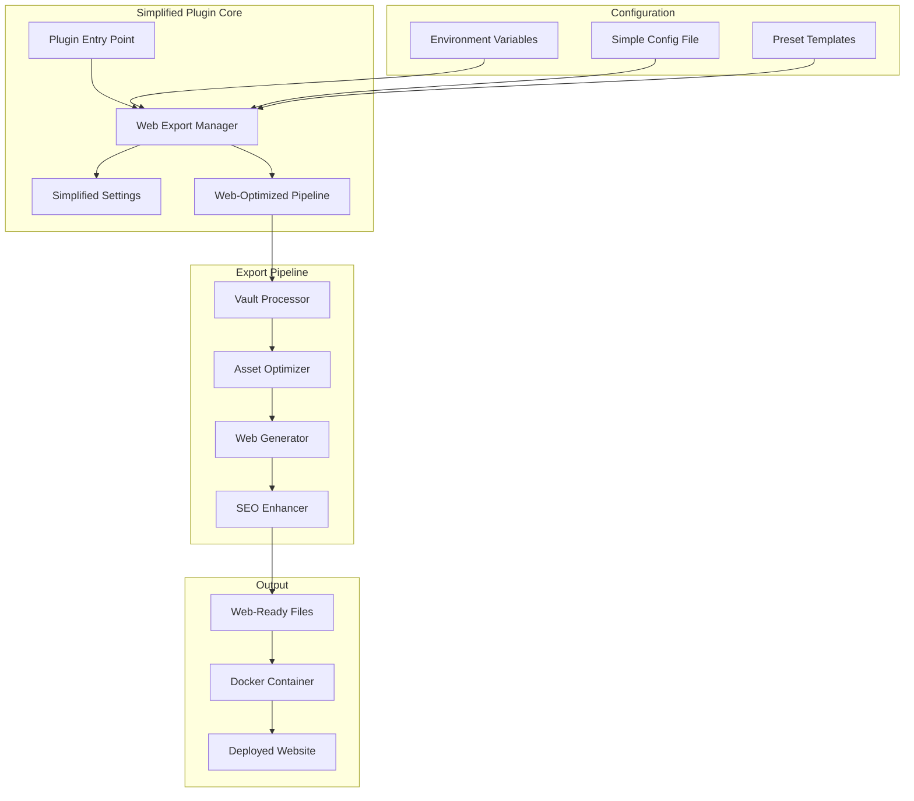
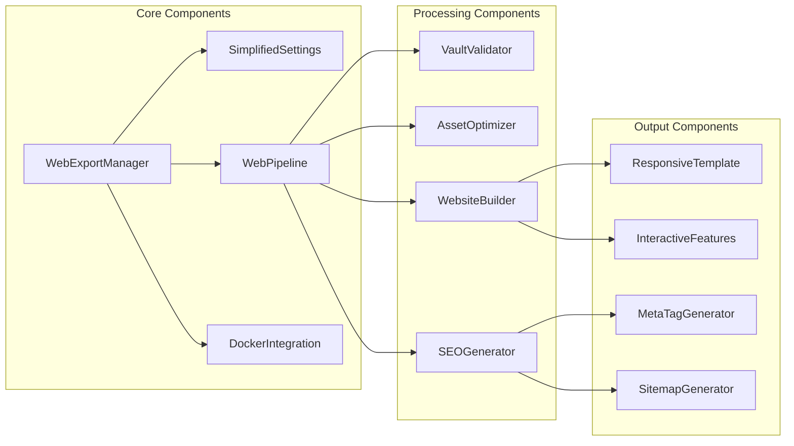

# Design Document

## Overview

This design document outlines the architecture and implementation approach for streamlining the Obsidian Webpage HTML Export plugin. The redesign focuses on simplifying the user experience while maintaining powerful web publishing capabilities through opinionated defaults and Docker-first deployment.

## Architecture

### High-Level Architecture



### Component Architecture



## Components and Interfaces

### 1. WebExportManager

**Purpose**: Central coordinator for the simplified export process

**Key Methods**:
```typescript
class WebExportManager {
    async exportForWeb(vault: Vault, config: WebConfig): Promise<WebsiteOutput>
    async validateVault(vaultPath: string): Promise<ValidationResult>
    async exportWithDocker(dockerConfig: DockerConfig): Promise<void>
}
```

**Responsibilities**:
- Orchestrate the entire export process
- Validate vault structure and content
- Handle Docker integration
- Provide progress feedback and error handling

### 2. SimplifiedSettings

**Purpose**: Manage the reduced set of configuration options

**Configuration Schema**:
```typescript
interface WebConfig {
    // Site Information (Required)
    siteName: string;
    siteDescription: string;
    siteUrl: string;
    
    // Features (All enabled by default)
    features: {
        search: boolean;
        graphView: boolean;
        navigation: boolean;
        themeToggle: boolean;
    };
    
    // SEO & Analytics (Optional)
    googleAnalyticsId?: string;
    customMetaTags?: Record<string, string>;
    
    // Advanced (Hidden from main UI)
    advanced?: {
        customCSS?: string;
        excludePatterns?: string[];
        imageOptimization?: boolean;
    };
}
```

**Settings UI Design**:
- **Basic Tab**: Site info, features toggle
- **SEO Tab**: Analytics, meta tags
- **Advanced Tab**: Hidden by default, accessible via toggle

### 3. WebPipeline

**Purpose**: Streamlined processing pipeline optimized for web deployment

**Pipeline Stages**:
```typescript
class WebPipeline {
    async processVault(vault: Vault, config: WebConfig): Promise<ProcessedVault>
    async optimizeAssets(assets: Asset[]): Promise<OptimizedAsset[]>
    async generateWebsite(content: ProcessedVault): Promise<Website>
    async enhanceSEO(website: Website): Promise<Website>
}
```

**Processing Flow**:
1. **Vault Processing**: Parse markdown, extract links and assets
2. **Asset Optimization**: Compress images, bundle CSS/JS
3. **Website Generation**: Create HTML pages with responsive templates
4. **SEO Enhancement**: Add meta tags, generate sitemap

### 4. DockerIntegration

**Purpose**: Seamless Docker deployment with minimal configuration

**Docker Interface**:
```typescript
class DockerIntegration {
    async buildContainer(vaultPath: string): Promise<ContainerImage>
    async runExport(config: DockerConfig): Promise<ExportResult>
    async generateGitHubActions(): Promise<WorkflowFile>
}
```

**Environment Variables**:
```bash
OBSIDIAN_SITE_NAME="My Digital Garden"
OBSIDIAN_SITE_URL="https://example.com"
OBSIDIAN_ANALYTICS_ID="GA_TRACKING_ID"
OBSIDIAN_EXCLUDE_PATTERNS="Private/**,Drafts/**"
```

## Data Models

### WebConfig Model

```typescript
interface WebConfig {
    version: string;
    site: {
        name: string;
        description: string;
        url: string;
        favicon?: string;
    };
    features: {
        search: boolean;
        graphView: boolean;
        navigation: boolean;
        themeToggle: boolean;
        backlinks: boolean;
        tags: boolean;
    };
    seo: {
        googleAnalyticsId?: string;
        customMetaTags?: MetaTag[];
        generateSitemap: boolean;
        generateRobotsTxt: boolean;
    };
    export: {
        excludePatterns: string[];
        imageOptimization: boolean;
        generateResponsiveImages: boolean;
    };
}
```

### ProcessedVault Model

```typescript
interface ProcessedVault {
    pages: WebPage[];
    assets: OptimizedAsset[];
    navigation: NavigationTree;
    searchIndex: SearchIndex;
    graphData: GraphData;
    metadata: VaultMetadata;
}
```

### WebPage Model

```typescript
interface WebPage {
    id: string;
    title: string;
    slug: string;
    content: string;
    frontmatter: Record<string, any>;
    links: Link[];
    backlinks: Link[];
    tags: string[];
    lastModified: Date;
    seoData: SEOData;
}
```

## Error Handling

### Validation Errors

```typescript
enum ValidationErrorType {
    MISSING_OBSIDIAN_CONFIG = "missing_obsidian_config",
    INVALID_VAULT_STRUCTURE = "invalid_vault_structure",
    MISSING_REQUIRED_CONFIG = "missing_required_config",
    INVALID_ASSET_REFERENCES = "invalid_asset_references"
}

class ValidationError extends Error {
    constructor(
        public type: ValidationErrorType,
        public details: string,
        public suggestions: string[]
    ) {
        super(details);
    }
}
```

### Error Recovery Strategies

1. **Missing Assets**: Log warning, continue export, generate placeholder
2. **Invalid Links**: Convert to plain text, log for user review
3. **Configuration Errors**: Use defaults, warn user
4. **Docker Failures**: Provide clear troubleshooting steps

## Testing Strategy

### Unit Testing

**Core Components**:
- WebExportManager export orchestration
- SimplifiedSettings configuration validation
- WebPipeline processing stages
- Asset optimization functions

**Test Coverage Targets**:
- Core functionality: 90%
- Error handling: 85%
- Configuration validation: 95%

### Integration Testing

**Docker Integration**:
- Container build and run processes
- Environment variable handling
- Volume mounting and file permissions
- GitHub Actions workflow generation

**End-to-End Testing**:
- Complete vault export scenarios
- Various vault structures and sizes
- Different configuration combinations
- Error recovery scenarios

### Performance Testing

**Benchmarks**:
- Small vault (< 100 notes): < 30 seconds
- Medium vault (100-1000 notes): < 2 minutes
- Large vault (1000+ notes): < 10 minutes

**Memory Usage**:
- Target: < 512MB for typical vaults
- Maximum: < 2GB for large vaults

## Implementation Phases

### Phase 1: Core Simplification
- Remove export mode selection
- Implement simplified settings interface
- Create web-optimized default configuration
- Update main export workflow

### Phase 2: Docker Enhancement
- Streamline Docker container
- Add environment variable configuration
- Generate GitHub Actions templates
- Improve error handling and logging

### Phase 3: Web Optimization
- Implement responsive image generation
- Add SEO meta tag generation
- Create sitemap and robots.txt generation
- Optimize asset bundling and compression

### Phase 4: Documentation and Polish
- Create simplified documentation
- Add video tutorials
- Implement user onboarding flow
- Performance optimization and bug fixes

## Migration Strategy

### Backward Compatibility

**Existing Configurations**:
- Detect legacy configuration format
- Automatically migrate to simplified format
- Preserve user customizations where possible
- Provide migration warnings and guidance

**Migration Process**:
```typescript
class ConfigMigrator {
    async migrateFromLegacy(legacyConfig: LegacyConfig): Promise<WebConfig>
    async validateMigration(config: WebConfig): Promise<ValidationResult>
    generateMigrationReport(changes: ConfigChange[]): MigrationReport
}
```

### User Communication

**Migration Notice**:
- Display one-time migration dialog
- Explain benefits of simplified interface
- Provide option to access advanced settings
- Link to migration guide documentation

## Security Considerations

### Input Validation
- Sanitize all user-provided configuration
- Validate file paths to prevent directory traversal
- Escape HTML content in generated pages
- Validate external URLs and resources

### Docker Security
- Run containers with minimal privileges
- Use read-only file systems where possible
- Validate mounted volumes and paths
- Implement resource limits and timeouts

### Output Security
- Generate Content Security Policy headers
- Sanitize generated HTML and JavaScript
- Validate external asset references
- Implement safe asset processing

## Performance Optimizations

### Asset Processing
- Parallel image optimization
- Incremental asset processing
- Smart caching of processed assets
- Lazy loading for large images

### Build Performance
- Incremental exports (only changed files)
- Parallel page generation
- Optimized Docker layer caching
- Efficient file system operations

### Runtime Performance
- Optimized search index generation
- Efficient graph data structures
- Compressed asset delivery
- Progressive loading of interactive features