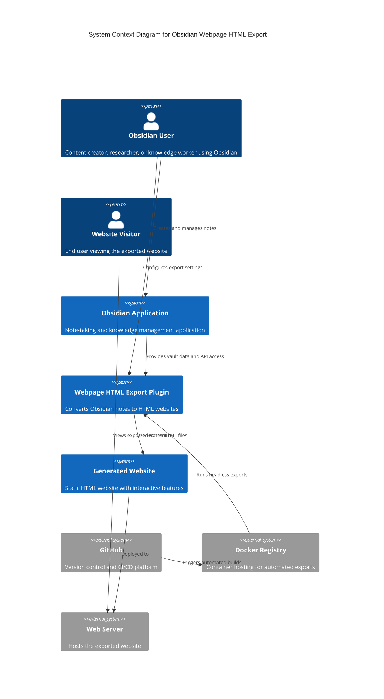
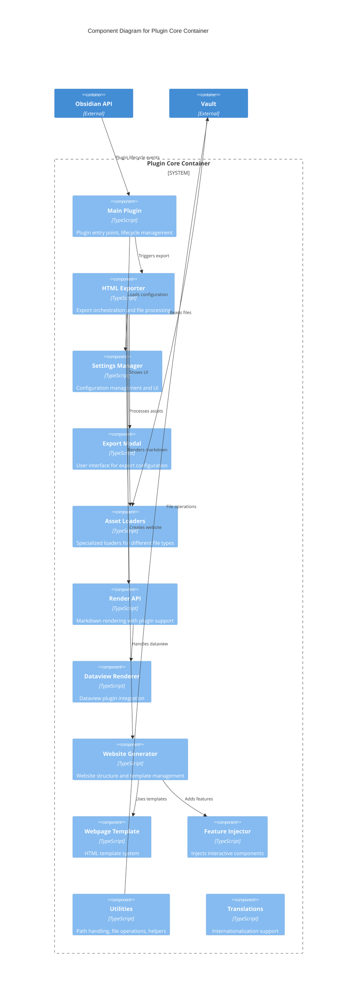

# C4 Architecture Documentation

## Level 1: System Context Diagram



## Level 2: Container Diagram

```mermaid
C4Container
    title Container Diagram for Obsidian Webpage HTML Export Plugin

    Person(user, "Obsidian User")
    Person(visitor, "Website Visitor")

    System_Boundary(obsidian_boundary, "Obsidian Application") {
        Container(vault, "Vault", "File System", "Markdown files, attachments, and configuration")
        Container(obsidian_api, "Obsidian API", "TypeScript/JavaScript", "Plugin framework and vault access")
    }

    System_Boundary(plugin_boundary, "Webpage HTML Export Plugin") {
        Container(plugin_core, "Plugin Core", "TypeScript", "Main plugin logic, settings, and export orchestration")
        Container(render_engine, "Render Engine", "TypeScript", "Markdown to HTML conversion with plugin support")
        Container(asset_handler, "Asset Handler", "TypeScript", "Processes CSS, JS, images, and other assets")
        Container(website_builder, "Website Builder", "TypeScript", "Generates complete website structure")
    }

    System_Boundary(frontend_boundary, "Generated Website Frontend") {
        Container(html_pages, "HTML Pages", "HTML/CSS/JS", "Individual note pages with navigation")
        Container(search_engine, "Search Engine", "JavaScript", "Client-side full-text search")
        Container(graph_view, "Graph View", "JavaScript", "Interactive note relationship visualization")
        Container(navigation, "Navigation Components", "JavaScript", "File tree, outline, theme toggle")
    }

    System_Boundary(docker_boundary, "Docker Container") {
        Container(headless_obsidian, "Headless Obsidian", "Electron", "Obsidian running without GUI")
        Container(export_runner, "Export Runner", "Shell Script", "Automated export execution")
    }

    Rel(user, obsidian_api, "Interacts with")
    Rel(obsidian_api, plugin_core, "Plugin lifecycle and events")
    Rel(plugin_core, vault, "Reads notes and assets")
    Rel(plugin_core, render_engine, "Converts markdown")
    Rel(plugin_core, asset_handler, "Processes assets")
    Rel(plugin_core, website_builder, "Generates website")
    Rel(website_builder, html_pages, "Creates")
    Rel(html_pages, search_engine, "Includes")
    Rel(html_pages, graph_view, "Includes")
    Rel(html_pages, navigation, "Includes")
    Rel(visitor, html_pages, "Views")
    Rel(export_runner, headless_obsidian, "Controls")
    Rel(headless_obsidian, plugin_core, "Runs export")

    UpdateLayoutConfig($c4ShapeInRow="2", $c4BoundaryInRow="1")
```



## Level 3: Component Diagram - Plugin Core



## Level 4: Code Diagram - Export Process

```mermaid
C4Code
    title Code Diagram for HTML Export Process

    System_Boundary(export_process, "HTML Export Process") {
        Code(html_exporter, "HTMLExporter", "Class", "Main export orchestrator")
        Code(website, "Website", "Class", "Website builder and manager")
        Code(webpage, "Webpage", "Class", "Individual page generator")
        Code(index, "Index", "Class", "Website index and file tracking")
        
        Code(asset_handler, "AssetHandler", "Class", "Asset processing coordinator")
        Code(css_loader, "CSSLoader", "Class", "CSS file processing")
        Code(js_loader, "JSLoader", "Class", "JavaScript file processing")
        Code(image_loader, "ImageLoader", "Class", "Image file processing")
        
        Code(render_api, "MarkdownRendererAPI", "Class", "Markdown to HTML conversion")
        Code(feature_generator, "FeatureGenerator", "Class", "Interactive feature creation")
        Code(template_engine, "WebpageTemplate", "Class", "HTML template processing")
    }

    Rel(html_exporter, website, "creates and builds")
    Rel(website, webpage, "generates pages")
    Rel(website, index, "tracks files")
    Rel(webpage, render_api, "converts markdown")
    Rel(webpage, asset_handler, "processes assets")
    Rel(asset_handler, css_loader, "handles CSS")
    Rel(asset_handler, js_loader, "handles JS")
    Rel(asset_handler, image_loader, "handles images")
    Rel(website, feature_generator, "adds features")
    Rel(webpage, template_engine, "applies templates")

    UpdateLayoutConfig($c4ShapeInRow="4", $c4BoundaryInRow="1")
```

## Architecture Patterns

### Plugin Architecture
- **Observer Pattern**: Listens to Obsidian vault events (file rename, etc.)
- **Command Pattern**: Implements Obsidian commands for different export modes
- **Factory Pattern**: Asset loaders for different file types
- **Template Method**: Webpage generation with customizable features

### Frontend Architecture
- **Module Pattern**: Self-contained JavaScript modules for each feature
- **Event-Driven**: Components communicate via custom events
- **Progressive Enhancement**: Core functionality works without JavaScript

### Build Architecture
- **Dual Build System**: Separate builds for plugin (Node.js) and frontend (browser)
- **Asset Pipeline**: Text file imports and binary asset handling
- **Tree Shaking**: Optimized bundles with unused code elimination

## Data Flow

### Export Process Flow
1. **Initialization**: Plugin loads settings and initializes asset handlers
2. **File Selection**: User selects files/folders or uses previous settings
3. **Website Creation**: Website object created with destination path
4. **File Processing**: Each markdown file converted to HTML webpage
5. **Asset Processing**: CSS, JS, images processed according to inline policies
6. **Feature Injection**: Interactive components added to pages
7. **Index Generation**: Search index and navigation data created
8. **File Writing**: All files written to destination directory

### Asset Processing Flow
1. **Discovery**: Assets discovered during markdown rendering
2. **Classification**: Assets classified by type (CSS, JS, image, etc.)
3. **Processing**: Type-specific processing (minification, inlining, etc.)
4. **Dependency Resolution**: Asset dependencies resolved and included
5. **Output**: Processed assets written or inlined in HTML

## Security Considerations

### Input Validation
- File path sanitization to prevent directory traversal
- Markdown content sanitization for XSS prevention
- Asset URL validation for external resources

### Output Security
- CSP headers in generated HTML
- Sanitized HTML output from markdown rendering
- Safe asset inlining without code injection

### Docker Security
- Non-root user execution in containers
- Minimal base image with only required dependencies
- Read-only file system where possible