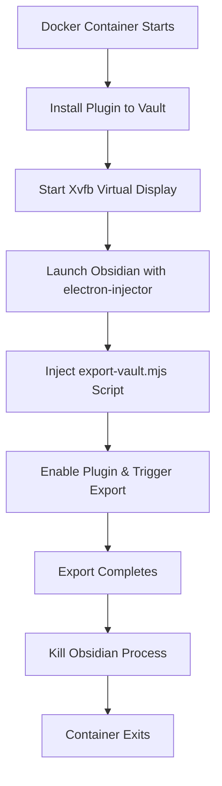

# Docker Automation Setup Guide

## Overview

The Obsidian Webpage HTML Export plugin provides Docker automation through a multi-stage container that runs Obsidian headlessly using electron-injector. This enables automated exports in CI/CD pipelines without requiring a GUI.

## How Docker Automation Works

### Architecture
1. **Multi-stage Build**: Plugin is built in Node.js container, electron-injector compiled in Rust container
2. **Headless Obsidian**: Full Obsidian installation runs without GUI using Xvfb (X Virtual Framebuffer)
3. **Electron Injection**: electron-injector injects JavaScript into Obsidian to trigger the export
4. **Volume Mounts**: Vault, output, and config are mounted as Docker volumes

### Process Flow


## Setup Methods

### Method 1: Using Pre-built Docker Image

#### Basic Usage
```bash
# Create directories
mkdir -p ./vault ./output

# Run export (entire vault)
docker run --rm \
  -v ./vault:/vault \
  -v ./output:/output \
  -e EXPORT_ENTIRE_VAULT=true \
  kosmosisdire/obsidian-webpage-export:latest
```

#### With Configuration File
```bash
# Create config.json (see configuration section below)
# Run with config
docker run --rm \
  -v ./vault:/vault \
  -v ./output:/output \
  -v ./config.json:/config.json \
  kosmosisdire/obsidian-webpage-export:latest
```

### Method 2: Docker Compose

Create `docker-compose.yml`:
```yaml
services:
  obsidian-export:
    image: kosmosisdire/obsidian-webpage-export:latest
    volumes:
      - ./vault:/vault
      - ./output:/output
      - ./export-config.json:/config.json
    environment:
      - EXPORT_ENTIRE_VAULT=true
    # Optional: VNC access for debugging
    ports:
      - "5900:5900"
    dns: 8.8.8.8
```

Run with:
```bash
docker-compose up
```

### Method 3: Building from Source

```bash
# Clone repository
git clone https://github.com/KosmosisDire/obsidian-webpage-export.git
cd obsidian-webpage-export

# Build image
docker build -t my-obsidian-export .

# Run
docker run --rm \
  -v ./vault:/vault \
  -v ./output:/output \
  my-obsidian-export
```

## Configuration

### Environment Variables

| Variable | Description | Default |
|----------|-------------|---------|
| `EXPORT_ENTIRE_VAULT` | Export all files in vault | `false` |
| `TZ` | Timezone for timestamps | `Etc/UTC` |
| `RUST_LOG` | Logging level for electron-injector | `debug` |

### Configuration File Format

Create `config.json` to customize export behavior:

```json
{
  "exportPath": "/output",
  "exportPreset": "online",
  "deleteOldFiles": true,
  "onlyExportModified": true,
  "openAfterExport": false,
  "filesToExport": [
    ["**/*.md"]
  ],
  "exportOptions": {
    "combineAsSingleFile": false,
    "slugifyPaths": true,
    "inlineCSS": false,
    "inlineJS": false,
    "inlineFonts": false,
    "inlineMedia": false,
    "inlineOther": false,
    "graphViewOptions": {
      "enabled": true,
      "showAttachments": false
    },
    "fileNavigationOptions": {
      "enabled": true,
      "showFolders": true
    },
    "searchOptions": {
      "enabled": true,
      "placeholder": "Search notes..."
    },
    "themeToggleOptions": {
      "enabled": true,
      "defaultTheme": "auto"
    },
    "rssOptions": {
      "enabled": true,
      "title": "My Digital Garden",
      "description": "Personal knowledge base",
      "link": "https://example.com"
    }
  }
}
```

### Vault Structure Requirements

Your vault must be properly structured for Docker export:

```
vault/
├── .obsidian/
│   ├── config.json
│   └── plugins/
│       └── webpage-html-export/  # Plugin will be installed here
├── notes/
│   ├── note1.md
│   └── note2.md
└── attachments/
    └── image.png
```

## CI/CD Integration

### GitHub Actions

Create `.github/workflows/export-obsidian.yml`:

```yaml
name: Export Obsidian Vault to HTML

on:
  push:
    branches: [main]
  pull_request:
    branches: [main]
  schedule:
    # Run daily at 2 AM UTC
    - cron: '0 2 * * *'

jobs:
  export:
    runs-on: ubuntu-latest
    
    steps:
      - name: Checkout repository
        uses: actions/checkout@v4
        
      - name: Create output directory
        run: mkdir -p ./output
        
      - name: Export vault with Docker
        run: |
          docker run --rm \
            -v ${{ github.workspace }}/vault:/vault \
            -v ${{ github.workspace }}/output:/output \
            -v ${{ github.workspace }}/export-config.json:/config.json \
            -e EXPORT_ENTIRE_VAULT=true \
            kosmosisdire/obsidian-webpage-export:latest
            
      - name: Upload export artifacts
        uses: actions/upload-artifact@v3
        with:
          name: exported-website
          path: ./output/
          
      - name: Deploy to GitHub Pages
        if: github.ref == 'refs/heads/main'
        uses: peaceiris/actions-gh-pages@v3
        with:
          github_token: ${{ secrets.GITHUB_TOKEN }}
          publish_dir: ./output
          cname: your-domain.com  # Optional: custom domain
```

### GitLab CI

Create `.gitlab-ci.yml`:

```yaml
stages:
  - export
  - deploy

variables:
  DOCKER_IMAGE: kosmosisdire/obsidian-webpage-export:latest

export_vault:
  stage: export
  image: docker:latest
  services:
    - docker:dind
  script:
    - mkdir -p ./output
    - docker run --rm 
        -v $PWD/vault:/vault 
        -v $PWD/output:/output 
        -v $PWD/export-config.json:/config.json 
        -e EXPORT_ENTIRE_VAULT=true 
        $DOCKER_IMAGE
  artifacts:
    paths:
      - output/
    expire_in: 1 week

deploy_pages:
  stage: deploy
  script:
    - cp -r output/* public/
  artifacts:
    paths:
      - public
  only:
    - main
```

### Jenkins Pipeline

Create `Jenkinsfile`:

```groovy
pipeline {
    agent any
    
    environment {
        DOCKER_IMAGE = 'kosmosisdire/obsidian-webpage-export:latest'
    }
    
    stages {
        stage('Checkout') {
            steps {
                checkout scm
            }
        }
        
        stage('Export Vault') {
            steps {
                script {
                    sh '''
                        mkdir -p ./output
                        docker run --rm \
                            -v $PWD/vault:/vault \
                            -v $PWD/output:/output \
                            -v $PWD/export-config.json:/config.json \
                            -e EXPORT_ENTIRE_VAULT=true \
                            ${DOCKER_IMAGE}
                    '''
                }
            }
        }
        
        stage('Archive Artifacts') {
            steps {
                archiveArtifacts artifacts: 'output/**/*', fingerprint: true
            }
        }
        
        stage('Deploy') {
            when {
                branch 'main'
            }
            steps {
                // Deploy to your hosting platform
                sh 'rsync -avz output/ user@server:/var/www/html/'
            }
        }
    }
    
    post {
        always {
            cleanWs()
        }
    }
}
```

## Advanced Configuration

### Custom Plugin Installation

If you need specific plugins in your vault:

```dockerfile
FROM kosmosisdire/obsidian-webpage-export:latest

# Copy additional plugins
COPY plugins/ /vault/.obsidian/plugins/

# Copy custom configuration
COPY obsidian-config.json /root/.config/obsidian/obsidian.json
```

### Memory and Performance Tuning

For large vaults, adjust Docker resources:

```bash
docker run --rm \
  --memory=4g \
  --cpus=2 \
  -v ./vault:/vault \
  -v ./output:/output \
  kosmosisdire/obsidian-webpage-export:latest
```

### Debugging Docker Export

Enable VNC for visual debugging:

```bash
# Run with VNC port exposed
docker run --rm \
  -p 5900:5900 \
  -v ./vault:/vault \
  -v ./output:/output \
  kosmosisdire/obsidian-webpage-export:latest

# Connect with VNC viewer to localhost:5900
# You can see Obsidian running during export
```

### Custom Export Script

Create custom export behavior by mounting your own script:

```javascript
// custom-export.mjs
console.log('Starting custom export...');

(async () => {
    try {
        await this.app.plugins.setEnable(true);
        await this.app.plugins.enablePlugin('webpage-html-export');
        const plugin = await this.app.plugins.getPlugin('webpage-html-export');
        
        // Custom export logic
        const specificFiles = this.app.vault.getFiles()
            .filter(file => file.path.startsWith('public/'));
            
        await plugin.exportFiles(specificFiles, '/output', true, true);
        
        console.log('Custom export completed');
    } finally {
        require('node:process').kill(process.pid, 'SIGKILL');
    }
})();
```

Mount and use:
```bash
docker run --rm \
  -v ./vault:/vault \
  -v ./output:/output \
  -v ./custom-export.mjs:/export-vault.mjs \
  kosmosisdire/obsidian-webpage-export:latest
```

## Troubleshooting

### Common Issues

#### Container Exits Immediately
**Cause**: Missing vault directory or permissions
**Solution**:
```bash
# Ensure vault exists and has proper permissions
mkdir -p ./vault
chmod 755 ./vault
```

#### Export Fails with "Plugin not found"
**Cause**: Plugin installation failed
**Solution**:
```bash
# Check if .obsidian directory exists in vault
ls -la ./vault/.obsidian/
# Ensure EXPORT_ENTIRE_VAULT is set
docker run -e EXPORT_ENTIRE_VAULT=true ...
```

#### Out of Memory Errors
**Cause**: Large vault exceeds container memory
**Solution**:
```bash
# Increase memory limit
docker run --memory=4g ...
# Or export in smaller batches
```

#### Permission Denied on Output
**Cause**: Docker user permissions
**Solution**:
```bash
# Fix output directory permissions
sudo chown -R $USER:$USER ./output
# Or run with user mapping
docker run --user $(id -u):$(id -g) ...
```

### Debugging Steps

1. **Check Container Logs**:
```bash
docker run --rm \
  -v ./vault:/vault \
  -v ./output:/output \
  kosmosisdire/obsidian-webpage-export:latest 2>&1 | tee export.log
```

2. **Verify Vault Structure**:
```bash
# Check vault contents
docker run --rm -v ./vault:/vault alpine ls -la /vault
```

3. **Test with Minimal Vault**:
```bash
# Create test vault
mkdir -p test-vault/.obsidian
echo "# Test Note" > test-vault/test.md
echo '{}' > test-vault/.obsidian/config.json

# Test export
docker run --rm \
  -v ./test-vault:/vault \
  -v ./output:/output \
  -e EXPORT_ENTIRE_VAULT=true \
  kosmosisdire/obsidian-webpage-export:latest
```

4. **Interactive Debugging**:
```bash
# Run container interactively
docker run -it --rm \
  -v ./vault:/vault \
  -v ./output:/output \
  --entrypoint /bin/bash \
  kosmosisdire/obsidian-webpage-export:latest

# Inside container, run export manually
/run.sh
```

### Performance Optimization

#### For Large Vaults
- Use `onlyExportModified: true` in config
- Export specific folders instead of entire vault
- Increase Docker memory allocation
- Use SSD storage for vault and output

#### For Frequent Exports
- Cache Docker image locally
- Use incremental exports
- Implement file change detection
- Use Docker layer caching in CI

## Security Considerations

### Container Security
- Container runs as root (required for Obsidian)
- No network access needed (set `--network none`)
- Mount volumes as read-only where possible
- Use specific image tags, not `latest`

### Vault Security
- Don't include sensitive files in automated exports
- Use `.gitignore` to exclude private notes
- Sanitize configuration files before CI
- Use secrets management for API keys

### Example Secure Setup
```bash
docker run --rm \
  --network none \
  --read-only \
  --tmpfs /tmp \
  --tmpfs /root \
  -v ./vault:/vault:ro \
  -v ./output:/output \
  -v ./config.json:/config.json:ro \
  kosmosisdire/obsidian-webpage-export:v1.9.2
```