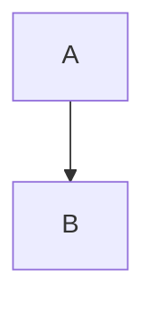

# Feature Reference Guide

## Core Features

### Export Modes

#### Online Export Mode
**Purpose**: Optimized for web hosting and online publishing
**Use Cases**: GitHub Pages, Netlify, personal websites, blogs

**Configuration**:
```json
{
  "exportPreset": "online",
  "inlineCSS": false,
  "inlineJS": false,
  "inlineFonts": false,
  "inlineMedia": false,
  "slugifyPaths": true,
  "combineAsSingleFile": false
}
```

**Features Enabled**:
- ✅ Full-text search
- ✅ Graph view
- ✅ File navigation
- ✅ RSS feed generation
- ✅ Theme toggle
- ✅ All interactive components

**Output Structure**:
```
output/
├── index.html
├── assets/
│   ├── css/
│   ├── js/
│   └── fonts/
├── pages/
│   └── [note-files].html
└── attachments/
    └── [media-files]
```

#### Local Export Mode
**Purpose**: Offline viewing and portable sharing
**Use Cases**: Presentations, offline documentation, email sharing

**Configuration**:
```json
{
  "exportPreset": "local",
  "inlineCSS": true,
  "inlineJS": true,
  "inlineFonts": true,
  "inlineMedia": true,
  "combineAsSingleFile": true
}
```

**Features Enabled**:
- ✅ Graph view
- ✅ File navigation
- ✅ Theme toggle
- ❌ Search (requires server)
- ❌ RSS feed

**Output Structure**:
```
output/
└── index.html (single file with everything embedded)
```

#### Raw Documents Mode
**Purpose**: Clean HTML conversion without interactive features
**Use Cases**: Simple document conversion, minimal websites

**Configuration**:
```json
{
  "exportPreset": "raw-documents",
  "inlineCSS": true,
  "inlineJS": true,
  "slugifyPaths": false,
  "allFeaturesDisabled": true
}
```

**Features Enabled**:
- ❌ All interactive features disabled
- ✅ Clean HTML output
- ✅ Preserved formatting
- ✅ Basic styling

### Interactive Components

#### Full-Text Search Engine

**Implementation**: Client-side search using MiniSearch library
**Features**:
- Fuzzy matching with typo tolerance
- Real-time search results
- Content preview snippets
- Keyboard navigation support

**Configuration Options**:
```typescript
searchOptions: {
  enabled: boolean;
  placeholder: string;
  position: 'top' | 'sidebar' | 'custom';
  fuzzyThreshold: number;
  maxResults: number;
}
```

**Search Index Structure**:
```json
{
  "documents": [
    {
      "id": "note-id",
      "title": "Note Title",
      "content": "Full note content",
      "tags": ["tag1", "tag2"],
      "path": "folder/note.html"
    }
  ],
  "settings": {
    "fuzzyThreshold": 0.2,
    "boost": {
      "title": 2,
      "tags": 1.5,
      "content": 1
    }
  }
}
```

**Usage Examples**:
```javascript
// Search API
const results = search.query('obsidian plugin');
const fuzzyResults = search.query('obsdian plgin'); // Handles typos
const tagSearch = search.query('tag:productivity');
```

#### Graph View Visualization

**Implementation**: D3.js-based force-directed graph
**Features**:
- Interactive node manipulation
- Zoom and pan controls
- Hover previews
- Link strength visualization
- Node clustering

**Configuration Options**:
```typescript
graphViewOptions: {
  enabled: boolean;
  showAttachments: boolean;
  nodeSize: 'fixed' | 'degree' | 'content-length';
  linkDistance: number;
  repelForce: number;
  centerForce: number;
  showLabels: boolean;
  colorScheme: 'default' | 'category' | 'custom';
}
```

**Graph Data Structure**:
```json
{
  "nodes": [
    {
      "id": "note-1",
      "title": "Note Title",
      "path": "note-1.html",
      "type": "note",
      "size": 10,
      "color": "#4f46e5"
    }
  ],
  "links": [
    {
      "source": "note-1",
      "target": "note-2",
      "strength": 1,
      "type": "internal-link"
    }
  ]
}
```

**Interaction Events**:
```javascript
// Graph event handlers
graph.on('nodeClick', (node) => {
  window.location.href = node.path;
});

graph.on('nodeHover', (node) => {
  showPreview(node.content);
});
```

#### File Navigation Tree

**Implementation**: Hierarchical tree component with lazy loading
**Features**:
- Collapsible folder structure
- Current page highlighting
- Search result highlighting
- Drag and drop support (view only)

**Configuration Options**:
```typescript
fileNavigationOptions: {
  enabled: boolean;
  showFolders: boolean;
  expandDepth: number;
  sortOrder: 'alphabetical' | 'modified' | 'created' | 'custom';
  showFileCount: boolean;
  showIcons: boolean;
}
```

**Tree Data Structure**:
```json
{
  "root": {
    "name": "Vault Root",
    "type": "folder",
    "children": [
      {
        "name": "Projects",
        "type": "folder",
        "children": [
          {
            "name": "Project 1.md",
            "type": "file",
            "path": "projects/project-1.html",
            "modified": "2023-10-30T10:00:00Z"
          }
        ]
      }
    ]
  }
}
```

#### Theme Toggle System

**Implementation**: CSS custom properties with JavaScript control
**Features**:
- Light/dark mode switching
- System preference detection
- Smooth transitions
- Persistent user choice

**Configuration Options**:
```typescript
themeToggleOptions: {
  enabled: boolean;
  defaultTheme: 'light' | 'dark' | 'auto';
  position: 'header' | 'sidebar' | 'floating';
  showLabel: boolean;
  animationDuration: number;
}
```

**Theme Implementation**:
```css
:root {
  --background-primary: #ffffff;
  --background-secondary: #f8f9fa;
  --text-primary: #1f2937;
  --text-secondary: #6b7280;
}

[data-theme="dark"] {
  --background-primary: #1f2937;
  --background-secondary: #111827;
  --text-primary: #f9fafb;
  --text-secondary: #d1d5db;
}
```

### Content Processing Features

#### Markdown Rendering Engine

**Implementation**: Custom renderer built on Obsidian's markdown processor
**Features**:
- Wikilink conversion
- Embed processing
- Plugin syntax support
- Math expression rendering
- Code syntax highlighting

**Supported Syntax**:
```markdown
# Standard Markdown
**bold**, *italic*, `code`

# Obsidian Extensions
[[Internal Link]]
![[Embedded Note]]
[[Note#Heading]]
[[Note|Display Text]]

# Plugin Syntax
```dataview
TABLE file.mtime FROM "Projects"
```



# Math
$inline math$ and $$block math$$
```

#### Asset Processing Pipeline

**Implementation**: Multi-stage asset processing with type-specific handlers
**Supported Asset Types**:
- CSS files (minification, inlining)
- JavaScript files (bundling, minification)
- Images (optimization, format conversion)
- Fonts (subsetting, inlining)
- Videos (format validation, linking)
- Documents (PDF, Office files)

**Processing Stages**:
1. **Discovery**: Find assets referenced in content
2. **Classification**: Determine asset type and processing rules
3. **Processing**: Apply type-specific transformations
4. **Optimization**: Compress and optimize for web
5. **Output**: Write to destination or inline in HTML

**Asset Handler Configuration**:
```typescript
assetHandlers: {
  css: {
    minify: boolean;
    inline: boolean;
    autoprefixer: boolean;
  },
  javascript: {
    minify: boolean;
    inline: boolean;
    bundle: boolean;
  },
  images: {
    optimize: boolean;
    maxWidth: number;
    quality: number;
    formats: string[];
  }
}
```

#### Plugin Integration System

**Dataview Integration**:
```typescript
// Dataview query processing
const dataviewRenderer = new DataviewRenderer();
const queryResult = await dataviewRenderer.render(query, context);
```

**Supported Plugins**:
- **Dataview**: Query rendering with full syntax support
- **Tasks**: Task list formatting and filtering
- **Templater**: Template processing during export
- **Excalidraw**: Drawing export as SVG/PNG
- **Mermaid**: Diagram rendering as SVG
- **MathJax**: Mathematical expression rendering

### Advanced Features

#### RSS Feed Generation

**Implementation**: Automatic RSS 2.0 feed generation
**Features**:
- Configurable feed metadata
- Date-based sorting
- Content excerpts
- Category support

**Configuration**:
```typescript
rssOptions: {
  enabled: boolean;
  title: string;
  description: string;
  link: string;
  dateProperty: string;
  maxItems: number;
  includeContent: boolean;
}
```

**Generated RSS Structure**:
```xml
<?xml version="1.0" encoding="UTF-8"?>
<rss version="2.0">
  <channel>
    <title>My Digital Garden</title>
    <description>Personal knowledge base</description>
    <link>https://example.com</link>
    <item>
      <title>Note Title</title>
      <link>https://example.com/note.html</link>
      <description>Note excerpt...</description>
      <pubDate>Mon, 30 Oct 2023 10:00:00 GMT</pubDate>
    </item>
  </channel>
</rss>
```

#### Link Preview System

**Implementation**: Hover-based content previews
**Features**:
- Instant content loading
- Formatted preview rendering
- Position-aware popup placement
- Mobile-friendly touch support

**Configuration**:
```typescript
linkPreviewOptions: {
  enabled: boolean;
  delay: number;
  maxWidth: number;
  showImages: boolean;
  showMetadata: boolean;
}
```

#### Backlinks System

**Implementation**: Automatic backlink detection and display
**Features**:
- Bidirectional link tracking
- Context snippets
- Link strength calculation
- Orphaned page detection

**Backlink Data Structure**:
```json
{
  "pageId": "current-note",
  "backlinks": [
    {
      "sourceId": "linking-note",
      "sourceTitle": "Linking Note Title",
      "sourcePath": "linking-note.html",
      "context": "...text around the link...",
      "linkText": "display text"
    }
  ]
}
```

### Customization Features

#### Custom Head Content

**Purpose**: Add custom HTML to document head
**Use Cases**: Analytics, SEO meta tags, custom scripts

**Configuration**:
```typescript
customHeadOptions: {
  enabled: boolean;
  content: string;
  position: 'before-title' | 'after-title' | 'end';
}
```

**Example Content**:
```html
<!-- SEO Meta Tags -->
<meta name="description" content="My digital garden">
<meta name="keywords" content="notes, knowledge, obsidian">
<meta name="author" content="Your Name">

<!-- Open Graph -->
<meta property="og:title" content="My Digital Garden">
<meta property="og:description" content="Personal knowledge base">
<meta property="og:image" content="/assets/og-image.png">

<!-- Analytics -->
<script async src="https://www.googletagmanager.com/gtag/js?id=GA_TRACKING_ID"></script>
<script>
  window.dataLayer = window.dataLayer || [];
  function gtag(){dataLayer.push(arguments);}
  gtag('js', new Date());
  gtag('config', 'GA_TRACKING_ID');
</script>

<!-- Custom Fonts -->
<link rel="preconnect" href="https://fonts.googleapis.com">
<link href="https://fonts.googleapis.com/css2?family=Inter:wght@400;500;600&display=swap" rel="stylesheet">
```

#### Component Positioning System

**Implementation**: Flexible component placement with CSS selectors
**Available Positions**:
- Header areas (left, center, right)
- Sidebar areas (top, middle, bottom)
- Content areas (before, after, floating)
- Footer areas (left, center, right)

**Position Configuration**:
```typescript
componentPosition: {
  target: string; // CSS selector
  method: 'append' | 'prepend' | 'replace' | 'before' | 'after';
  wrapper: string; // Optional wrapper element
  classes: string[]; // Additional CSS classes
}
```

**Example Positioning**:
```typescript
// Place search in header
searchOptions: {
  position: {
    target: '.header-right',
    method: 'prepend',
    wrapper: 'div',
    classes: ['search-container']
  }
}

// Place graph view in sidebar
graphViewOptions: {
  position: {
    target: '.sidebar-content',
    method: 'append',
    classes: ['graph-container', 'collapsible']
  }
}
```

## Feature Compatibility Matrix

| Feature | Online Mode | Local Mode | Raw Documents |
|---------|-------------|------------|---------------|
| Search | ✅ | ❌ | ❌ |
| Graph View | ✅ | ✅ | ❌ |
| File Navigation | ✅ | ✅ | ❌ |
| Theme Toggle | ✅ | ✅ | ❌ |
| RSS Feed | ✅ | ❌ | ❌ |
| Link Previews | ✅ | ✅ | ❌ |
| Backlinks | ✅ | ✅ | ❌ |
| Document Outline | ✅ | ✅ | ✅ |
| Properties Display | ✅ | ✅ | ✅ |
| Tags Display | ✅ | ✅ | ✅ |
| Math Rendering | ✅ | ✅ | ✅ |
| Code Highlighting | ✅ | ✅ | ✅ |
| Plugin Integration | ✅ | ✅ | ✅ |

## Performance Characteristics

### Export Performance
- **Small Vault** (< 100 notes): 5-15 seconds
- **Medium Vault** (100-1000 notes): 30-120 seconds  
- **Large Vault** (1000+ notes): 2-10 minutes

### Runtime Performance
- **Search Response**: < 100ms for 1000+ documents
- **Graph Rendering**: < 500ms for 500+ nodes
- **Page Load**: < 2 seconds for typical pages
- **Navigation**: Instant for cached content

### Memory Usage
- **Export Process**: 100-500MB depending on vault size
- **Browser Runtime**: 50-200MB for typical websites
- **Search Index**: 1-5MB for 1000 documents
- **Graph Data**: 500KB-2MB for 500+ nodes